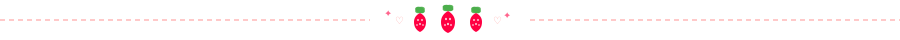

<div align="center">

<!-- Banner -->


<!-- gatinho GIF decorativo -->

&nbsp;&nbsp;

&nbsp;&nbsp;


<br/>

<!-- Badges de contato -->
[](https://www.linkedin.com/in/marjorye-porto-pican%C3%A7o-372ab9315/)
[](https://www.instagram.com/marjorye.p.picanco)

<!-- SEPARADOR MORANGUINHO -->


</div>

<div align="center">

## ✦ sobre mim ✦

```
╔══════════════════════════════════════════════════════╗
║   🎀  Olá! Seja bem-vinda(o) ao meu perfil!  🎀     ║
║                                                      ║
║   🎓  FATEC — Análise e Desenvolvimento de Sistemas  ║
║   🎮  Aprendendo RPG Maker MV                        ║
║   🌸  Futura desenvolvedora de jogos                 ║
║   ✍️   Escritora de histórias e roteiros             ║
║   🎨  Artista digital (desenhos e pinturas)          ║
║   👾  Criadora de conteúdo ARG / Analog Horror       ║
║   🌐  Hobby: fazer páginas em HTML                   ║
╚══════════════════════════════════════════════════════╝
```

</div>

<div align="center">

</div>

<div align="center">

## 🎀 linguagens & habilidades 🎀

| Linguagem | Nível | Proficiência |
|:---------:|:-----:|:------------:|
| 🌐 HTML | ████████████████████ | 90% |
| 🐍 Python | ████████████████░░░░ | 80% |
| 🎯 C# | █████████████████░░░ | 85% |
| ☕ Java | ██████████████░░░░░░ | 70% |
| 💻 C | ██████████████░░░░░░ | 70% |

<br/>


</div>

<div align="center">

</div>

<div align="center">

## 🌸 meus interesses 🌸

<table>
<tr>
<td align="center" width="200">

🎨 **Arte Digital**
<br/>
Desenhos e pinturas digitais são minha paixão! Cada pixel com amor 💕

</td>
<td align="center" width="200">

👾 **Analog Horror & ARG**
<br/>
Criação de narrativas perturbadoras e experiências interativas de mistério

</td>
<td align="center" width="200">

🎮 **Game Dev**
<br/>
Desenvolvendo jogos no RPG Maker MV para compartilhar minhas histórias com o mundo

</td>
</tr>
<tr>
<td align="center" width="200">

🌐 **HTML Criativo**
<br/>
Faço páginas em HTML como hobby — adoro personalizar tudo!

</td>
<td align="center" width="200">

✍️ **Escrita**
<br/>
Escrevo histórias e roteiros que um dia vão virar jogos incríveis

</td>
<td align="center" width="200">

🎀 **Hello Kitty**
<br/>
Eterna fã da gatinha mais fofa do mundo! 🐱

</td>
</tr>
</table>

</div>

<div align="center">

</div>

<div align="center">

## 📊 estatísticas do github 📊


<br/>


</div>

<div align="center">

</div>

<div align="center">

## 🐱 um recadinho da kitty 🐱

> *"Você pode ser qualquer coisa que quiser ser."*
> — Hello Kitty 🎀


<br/>


</div>

<!-- Footer wave -->

